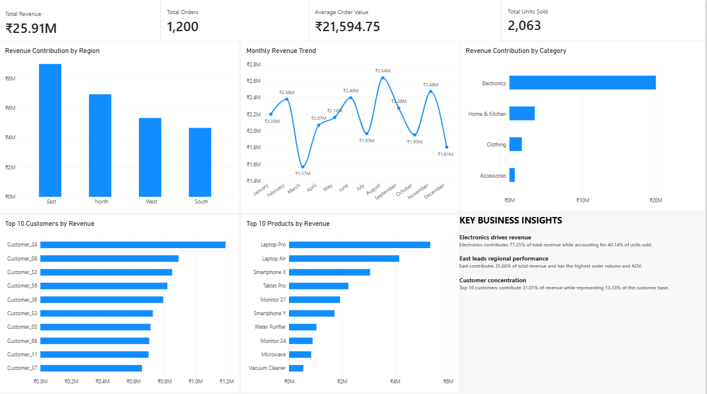

# Customer & Revenue Analytics

## Project Overview

An end-to-end e-commerce analytics project using SQL, Excel, and Power BI to understand revenue performance, customer contribution, product performance, and regional trends.

## Business Questions

- Where is revenue coming from?
- Which customers contribute the most revenue?
- Which products and categories drive revenue?
- How do regions perform?
- How does revenue change month to month?

## Dataset

The project uses an e-commerce transactions dataset containing:

- 1,200 transactions
- 75 customers
- 30 products
- 4 regions
- 4 product categories
- 2025 transaction data

## Tools Used

- SQL
- Microsoft Excel
- Power BI

## Key KPIs

| KPI | Value |
|---|---:|
| Total Revenue | ₹25.91M |
| Total Orders | 1,200 |
| Total Units Sold | 2,063 |
| Average Order Value | ₹21,594.75 |

## Key Insights

### Electronics drives revenue

Electronics contributes **77.25% of total revenue** while accounting for **40.14% of units sold**, indicating that higher-value products contribute significantly to revenue.

### East leads regional performance

The East region contributes **35.66% of total revenue** and leads in both order volume and AOV.

### Customer concentration

The top 10 customers contribute **31.01% of revenue** while representing **13.33% of the customer base**.

### Product performance

Laptop Pro generated the highest product revenue at **₹5.33M**, while Monitor 27 sold more units but generated lower revenue, highlighting the impact of product price on revenue contribution.

## Power BI Dashboard

The project includes an interactive Power BI dashboard covering:

- Revenue KPIs
- Regional performance
- Monthly revenue trends
- Category contribution
- Top 10 customers
- Top 10 products
- Business insights

### Dashboard Preview

## Project Files

| File | Description |
|---|---|
| `Customer_Revenue_Analytics_Project_v2.xlsx` | Project dataset and Excel analysis |
| `customer_revenue_analysis.sql` | SQL analysis queries |
| `customer_revenue_dashboard.png` | Power BI dashboard screenshot |

## Learning Outcome

This project strengthened practical skills in SQL querying, Excel-based analysis, Power BI dashboard development, data cleaning, KPI analysis, and business storytelling.
